<div align="center">




<br/>


</div>

<br/>

```
> whoami
```

```yaml
unit: Jude Joby Joseph
class: MCA Graduate · Software Engineer · ML Researcher
status: 🟢 ONLINE — Open to Work
deployment_targets: IT Support · Systems Admin · AI/Software Trainee
origin: Curiosity in Cybersecurity → Building Secure, Intelligent Systems
```

<div align="center">

</div>

## ⚡ CURRENT DIRECTIVES

```diff
+ Building a custom audio classifier to detect environmental sound events (laughter, clapping)
+ Architecting a decentralized, always-on private cloud server for personal storage infrastructure
+ Researching automated diagnostics — co-authored "Thyroid Disease Prediction" (XGBoost) — published in IJSET
```

## 🛰️ DEPLOYED SYSTEMS

<table>
<tr>
<td width="50%">

### 🐝 HIVE Mesh Network
Decentralized hyper-local mesh grid enabling off-grid, disaster-resilient communication — built on the Android Nearby Connections API.
`Android` `Mesh Networking` `Offline-First`

</td>
<td width="50%">

### 🔒 Secure RCE Engine
Containerized online compiler executing untrusted code across 5+ languages inside isolated, auto-destructing Docker sandboxes — deployed on AWS EC2.
`Node.js` `Docker` `Flask` `AWS EC2`

</td>
</tr>
<tr>
<td width="50%">

### 🏠 DormMate
Hostel management system with a serverless AI chatbot and ML-based meal prediction engine.
`Serverless` `AI Chatbot` `ML`

</td>
<td width="50%">

### 🎓 EduMatrix
Educational management system built to unify administration across combined departments.
`Full-Stack` `Admin Systems`

</td>
</tr>
</table>

<div align="center">

[](https://github.com/judejjj?tab=repositories)

</div>

## 🧬 CORE ARSENAL

<div align="center">


</div>

## 📡 SIGNAL TRANSMISSION LOG

<div align="center">


</div>

> ⚙️ **Why this kept breaking:** the old stats widget (`github-readme-stats.vercel.app`) is a shared free service that's been unstable for months — it's a known, widespread issue, not something wrong with your setup. The fix below generates your stats as a **file stored in your own repo** instead of pinging a live third-party server every time someone visits — so it can't go down. Full YAML workflow at the bottom of this message.

## 👾 PACMAN INTERCEPT

<picture>
  <source media="(prefers-color-scheme: dark)" srcset="https://raw.githubusercontent.com/judejjj/judejjj/output/pacman-contribution-graph-dark.svg">
  <source media="(prefers-color-scheme: light)" srcset="https://raw.githubusercontent.com/judejjj/judejjj/output/pacman-contribution-graph.svg">
  
</picture>

> ⚙️ **One-time setup** (the earlier repo I linked was wrong — corrected below): use **[abozanona/pacman-contribution-graph](https://github.com/abozanona/pacman-contribution-graph)**. Full YAML workflow provided at the bottom of this message.

## 🪐 3D CONTRIBUTION FIELD

<div align="center">

</div>

> ⚙️ **One-time setup:** add the **[yoshi389111/github-profile-3d-contrib](https://github.com/yoshi389111/github-profile-3d-contrib)** Action — turns your contribution graph into a rotating 3D skyline. Same idea as the Pacman widget: set it up once, it updates itself forever.

## ⚙️ ONE-TIME SETUP — AUTOMATION WORKFLOWS

Everything below only needs to be done **once**. Create a repo named **exactly** `judejjj` (your username) if you haven't already, then inside it create a folder `.github/workflows/` and drop in these three files. Each one runs on a daily timer and writes its output as a file into your repo — that's what makes them immune to the "third-party server is down" problem.

**1. Pacman Intercept** → `.github/workflows/pacman.yml`
```yaml
name: Generate Pac-Man Contribution Graph
on:
  schedule:
    - cron: "0 */24 * * *"
  workflow_dispatch:
  push:
    branches: [main]
jobs:
  generate:
    permissions:
      contents: write
    runs-on: ubuntu-latest
    timeout-minutes: 5
    steps:
      - name: Generate pacman-contribution-graph.svg
        uses: abozanona/pacman-contribution-graph@main
        env:
          GITHUB_TOKEN: ${{ secrets.GITHUB_TOKEN }}
        with:
          github_user_name: judejjj
```

**2. 3D Contribution Field** → `.github/workflows/3d-contrib.yml`
```yaml
name: 3D Contribution Graph
on:
  schedule:
    - cron: "0 0 * * *"
  workflow_dispatch:
jobs:
  build:
    runs-on: ubuntu-latest
    steps:
      - uses: actions/checkout@v4
        with:
          ref: main
      - uses: yoshi389111/github-profile-3d-contrib@0.7.1
        env:
          GITHUB_TOKEN: ${{ secrets.GITHUB_TOKEN }}
        with:
          username: judejjj
      - name: Commit output
        run: |
          git config user.name github-actions
          git config user.email github-actions@github.com
          git add -f profile-3d-contrib || true
          git commit -m "update 3d contribution graph" || exit 0
          git push
```

**3. Signal Transmission Log (stats)** → `.github/workflows/metrics.yml`
```yaml
name: Metrics
on:
  schedule:
    - cron: "0 0 * * *"
  workflow_dispatch:
jobs:
  metrics:
    runs-on: ubuntu-latest
    steps:
      - uses: lowlighter/metrics@latest
        with:
          token: ${{ secrets.GITHUB_TOKEN }}
          user: judejjj
          filename: assets/metrics.svg
          template: classic
          base: header, activity, community, repositories
```

> Note: these are third-party open-source Actions maintained outside Anthropic — occasionally their exact input names change with new versions. If a workflow fails on first run, open the "Actions" tab in your repo, click the failed run, and check the error — it'll usually tell you exactly which parameter needs adjusting. Worth checking each project's own README on GitHub for the latest syntax before pasting.

## 🔗 OPEN CHANNELS

<div align="center">

[](https://www.linkedin.com/in/judejobyjoseph/)
[](https://judejj.vercel.app)
[](mailto:judejobyjoseph@gmail.com)

</div>

<div align="center">

```
> awaiting incoming transmission...
> connection stable // ready to collaborate
```


</div>
